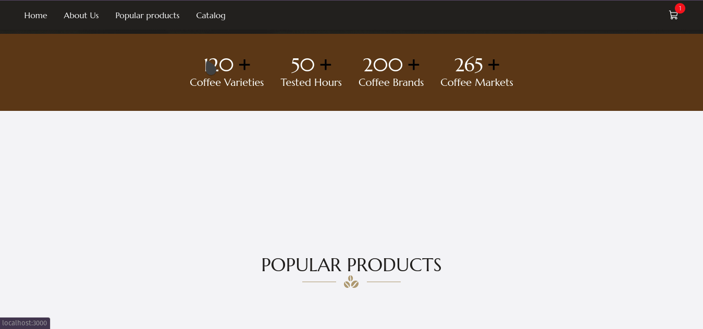

[](https://github.com/avnerjose/reactjs-nextjs-coffee-shop/actions/workflows/ci.yaml)

<h1 align="center">
   
</h1>

## ⚡️ The project
  This is an Coffee-Shop e-commerce app created with NextJS with GraphQL API integration for me to practice most of the things I learned on Front-end development.
## 🎯 Features
 - [x] - GraphQL api integration 
 - [x] - Shopping cart with local storage
 - [x] - Form validation
 - [x] - Unit and E2E tests
 - [x] - Full component documentation using Storybook
 - [x] - CI with Github Actions 
 - [ ] - Animations
 - [ ] - Dark/Light theme
  
## 🖥️ Used technologies
 - [ReactJS](https://reactjs.org/)
 - [NextJS](https://nextjs.org/)
 - [TailwindCSS](https://tailwindcss.com/)
 - [React-Hook-Form](https://react-hook-form.com/)
 - [Cypress](https://www.cypress.io/)
 - [Vitest](https://vitest.dev/)
 - [Storybook](https://storybook.js.org/)
 - [Apollo Client](https://www.apollographql.com/docs/react/)

## ⚙️ Project Dependencies
 - [Yarn](https://yarnpkg.com/)
 
## 🚀️ Executando o projeto

1. Clone the repository: 

```bash
git clone https://github.com/avnerjose/reactjs-nextjs-coffee-shop.git && cd reactjs-nextjs-coffee-shop
```
2. Install all dependencies

```bash
yarn
```
3. Run the app
```bash
yarn dev
```
1. Open [localhost:3000](http://localhost:3000) to see the app running


## 🌡️ Tests 

1. Unit tests using Vitest
```bash
yarn test
``` 
1. E2E tests using Cypress
```bash 
yarn cypress
``` 